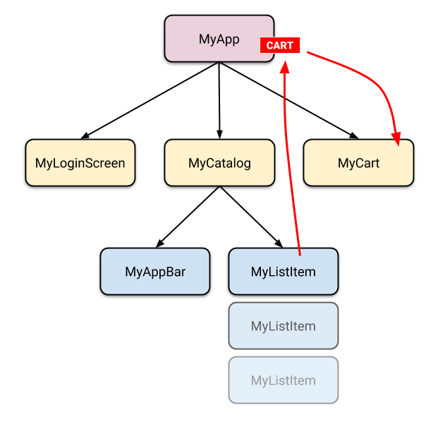
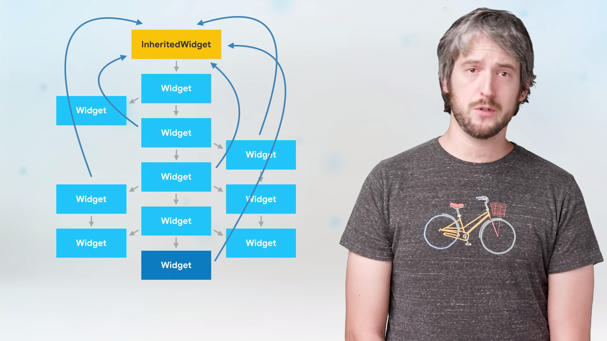

# Flutter State Management

## How to distinguish it

## Lifting State Up

## setState

[Example](https://github.com/FlutterSuji/state-management/tree/master/vanilla)

## InheritedWidget

### References

- [Inherited Widgets Explained - Flutter Widgets 101 Ep. 3](https://www.youtube.com/watch?v=Zbm3hjPjQMk)
- [Example](https://github.com/FlutterSuji/state-management/tree/master/inherited_widget)

## Provider

[A syntactic sugar of `InheritedWidget`](https://thinkdiff.net/flutter-and-dart/how-to-manage-state-in-flutter-using-provider/)

### Exposing a value

- Provider
- ChangeNotifierProvider
- MultiProvider
- ProxyProvider

### Reading a value

- Provider.of
- Consumer
- Selector

### References

- [Provider package](https://pub.dev/packages/provider)
- [Example](https://github.com/FlutterSuji/state-management/tree/master/proivider)
